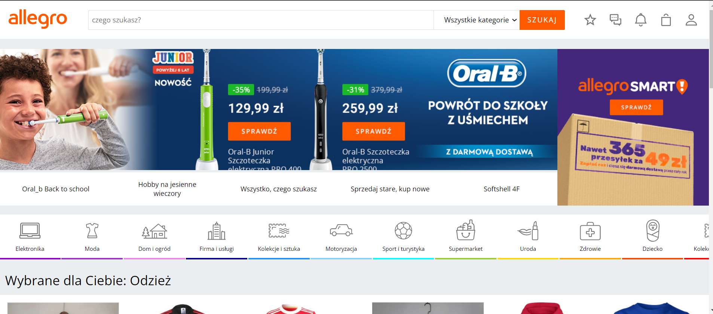
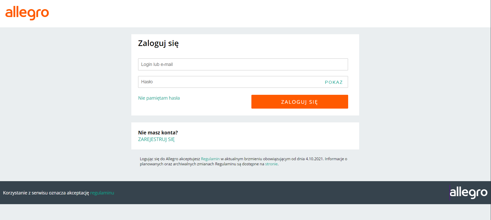
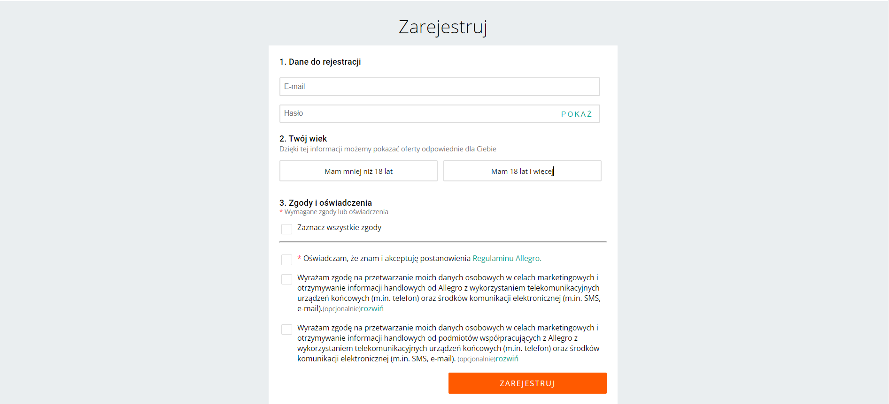

# <Allegro-Clone>

## About

A small web app that tries to imitate the desktop web version of allegro site. It is full responsive desktop app where you can sign up or log in and have your user authentification feauture thanks to Firebase.

## Demo

 Here is a working live demo : [DEMO](https://marcin082.github.io/allegro-clone/)







## Built with

* Javascript
* Scss
* React
* React Router
* Context API
* Authentication with firebase

## Installation

### Install Node JS
Refer to [https://nodejs.org/en/](https://nodejs.org/en/) to install nodejs

### Install create-react-app
Install create-react-app npm package globally. This will help to easily run the project and also build the source files easily. Use the following command to install create-react-app

```bash
npm install -g create-react-app
```

## Cloning and Running the Application in local

Clone the project into local

Install all the npm packages. Go into the project folder and type the following command to install all npm packages

```bash
npm install
```

In order to run the application Type the following command

```bash
npm start
```

The Application Runs on **localhost:3000**

